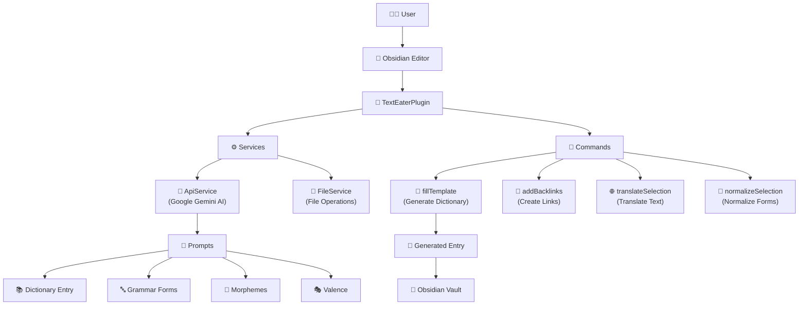
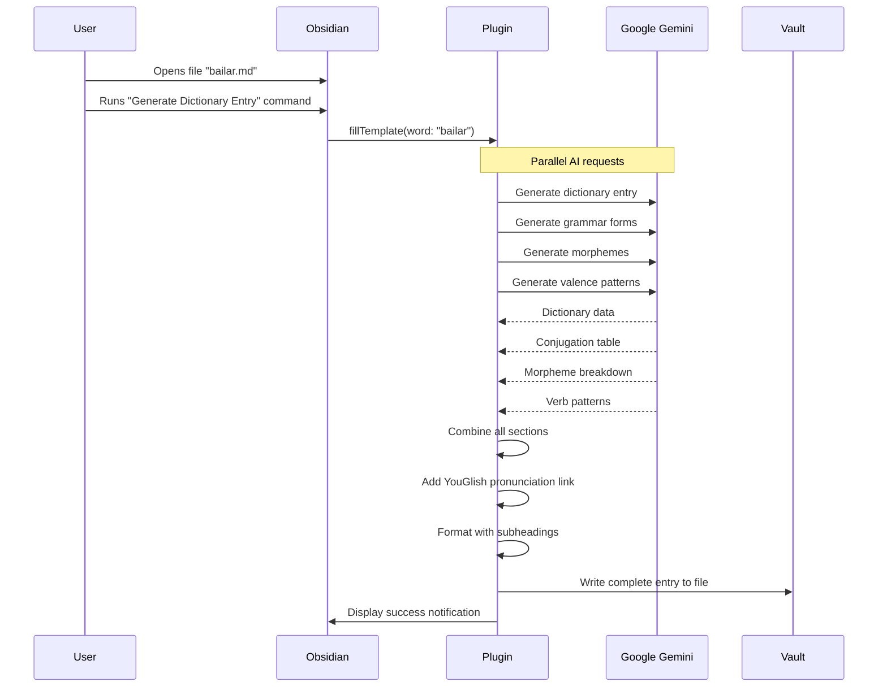
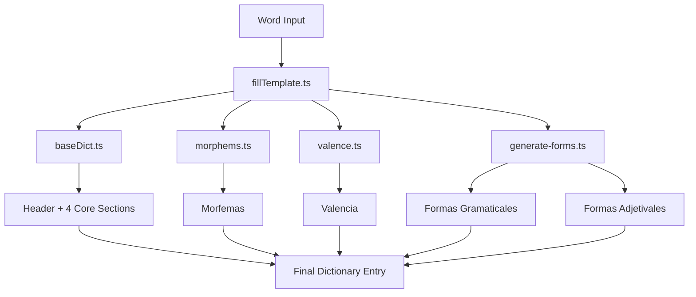
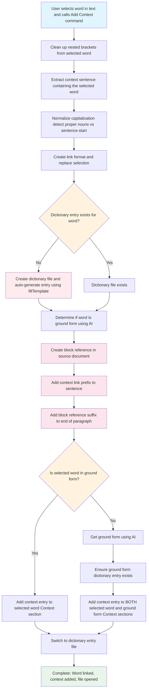
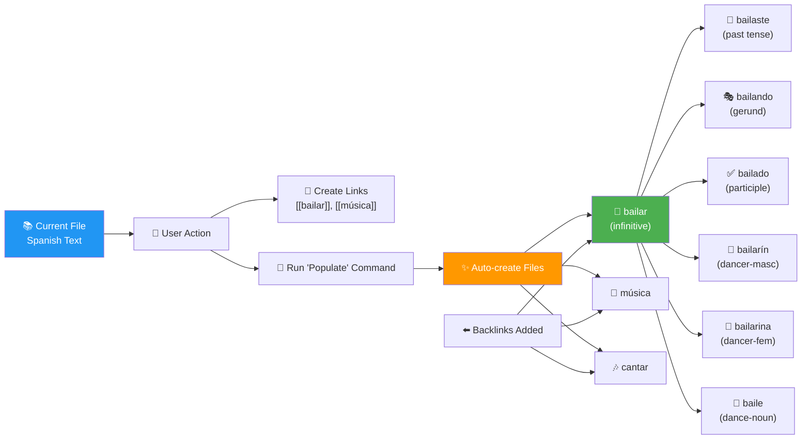

## 🏗️ Architecture Diagram



## 🔄 Main Workflow: Dictionary Entry Generation



## 📚 Dictionary Entry Structure


## 🔗 Add Context Command Workflow



### 🔍 Key Features of Add Context Command:

1. **Smart Capitalization Handling**: Detects proper nouns vs sentence-start capitalization
2. **Context Sentence Extraction**: Uses cursor position to find the most relevant sentence
3. **Automatic Dictionary Generation**: Creates full dictionary entries when needed
4. **Block Reference System**: Creates numbered anchors with context links
5. **Ground Form Detection**: Uses AI to determine canonical word forms
6. **Dual Context Addition**: Adds context to both inflected and ground forms
7. **Automatic Navigation**: Opens the dictionary entry after completion

### 📝 Context Entry Format:
```
- *[[SourceFile#^contextN|^]]* Context sentence containing the word...
```

## 🔗 Backlink System & Word Network

