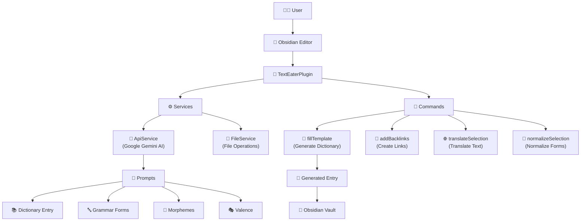
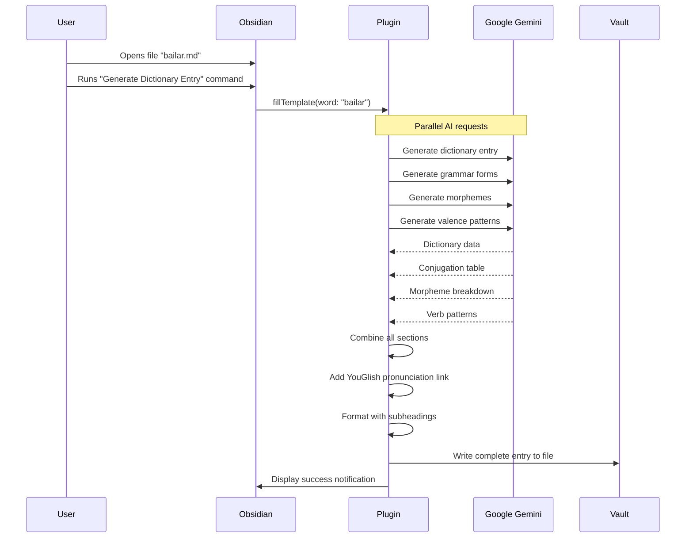
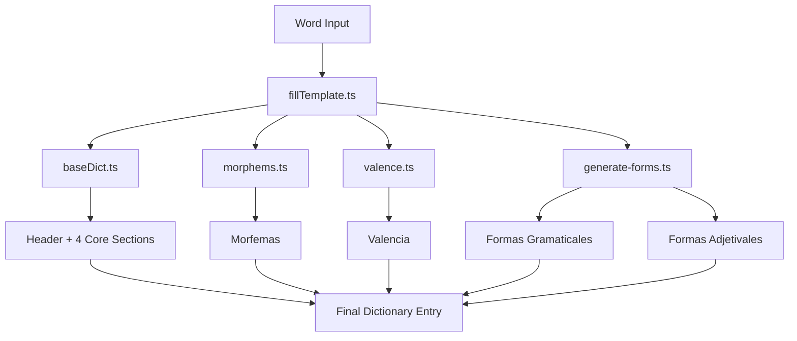
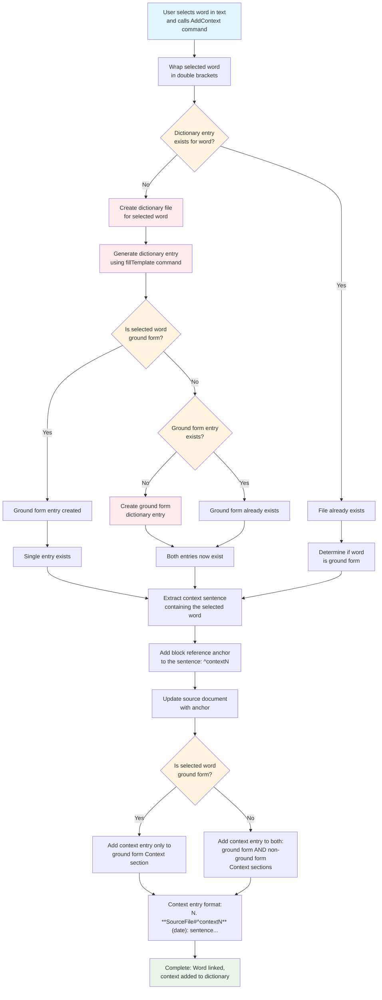
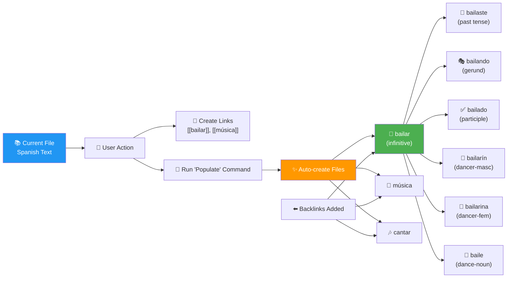

## 🏗️ Architecture Diagram

```mermaid 
graph TD
    A["🧑‍💻 User"] --> B["📝 Obsidian Editor"]
    B --> C["🔌 TextEaterPlugin"]
    
    C --> D["⚙️ Services"]
    D --> E["🤖 ApiService<br/>(Google Gemini AI)"]
    D --> F["📁 FileService<br/>(File Operations)"]
    
    C --> G["🎯 Commands"]
    G --> H["📖 fillTemplate<br/>(Generate Dictionary)"]
    G --> I["🔗 addBacklinks<br/>(Create Links)"]
    G --> J["🌐 translateSelection<br/>(Translate Text)"]
    G --> K["📏 normalizeSelection<br/>(Normalize Forms)"]
    
    E --> L["📝 Prompts"]
    L --> M["📚 Dictionary Entry"]
    L --> N["🔤 Grammar Forms"]
    L --> O["🧬 Morphemes"]
    L --> P["🎭 Valence"]
    
    H --> Q["📄 Generated Entry"]
    Q --> R["💾 Obsidian Vault"]
```

## 🔄 Main Workflow: Dictionary Entry Generation

```mermaid
sequenceDiagram
    participant U as User
    participant O as Obsidian
    participant P as Plugin
    participant AI as Google Gemini
    participant V as Vault
    
    U->>O: Opens file "bailar.md"
    U->>O: Runs "Generate Dictionary Entry" command
    O->>P: fillTemplate(word: "bailar")
    
    Note over P,AI: Parallel AI requests
    P->>AI: Generate dictionary entry
    P->>AI: Generate grammar forms
    P->>AI: Generate morphemes
    P->>AI: Generate valence patterns
    
    AI-->>P: Dictionary data
    AI-->>P: Conjugation table
    AI-->>P: Morpheme breakdown
    AI-->>P: Verb patterns
    
    P->>P: Combine all sections
    P->>P: Add YouGlish pronunciation link
    P->>P: Format with subheadings
    
    P->>V: Write complete entry to file
    P->>O: Display success notification
```

## 📚 Dictionary Entry Structure

```mermaid
graph TD
    A[Word Input] --> B[fillTemplate.ts]
    B --> C[baseDict.ts]
    B --> D[morphems.ts] 
    B --> E[valence.ts]
    B --> F[generate-forms.ts]
    
    C --> G[Header + 4 Core Sections]
    D --> H[Morfemas]
    E --> I[Valencia]
    F --> J[Formas Gramaticales]
    F --> K[Formas Adjetivales]
    
    G --> L[Final Dictionary Entry]
    H --> L
    I --> L
    J --> L
    K --> L
```

## 🔗 Add Context Command Workflow

```mermaid
flowchart TD
    A["User selects word in text<br/>and calls AddContext command"] --> B["Wrap selected word<br/>in double brackets"]
    
    B --> C{"Dictionary entry<br/>exists for word?"}
    
    C -->|No| D["Create dictionary file<br/>for selected word"]
    C -->|Yes| E["File already exists"]
    
    D --> F["Generate dictionary entry<br/>using fillTemplate command"]
    
    F --> G{"Is selected word<br/>ground form?"}
    
    G -->|Yes| H["Ground form entry created"]
    G -->|No| I{"Ground form entry<br/>exists?"}
    
    I -->|No| J["Create ground form<br/>dictionary entry"]
    I -->|Yes| K["Ground form already exists"]
    
    J --> L["Both entries now exist"]
    K --> L
    H --> M["Single entry exists"]
    E --> N["Determine if word<br/>is ground form"]
    
    M --> O["Extract context sentence<br/>containing the selected word"]
    L --> O
    N --> O
    
    O --> P["Add block reference anchor<br/>to the sentence: ^contextN"]
    
    P --> Q["Update source document<br/>with anchor"]
    
    Q --> R{"Is selected word<br/>ground form?"}
    
    R -->|Yes| S["Add context entry only to<br/>ground form Context section"]
    R -->|No| T["Add context entry to both:<br/>ground form AND non-ground form<br/>Context sections"]
    
    S --> U["Context entry format:<br/>N. **SourceFile#^contextN** (date): sentence..."]
    T --> U
    
    U --> V["Complete: Word linked,<br/>context added to dictionary"]
    
    style A fill:#e1f5fe
    style V fill:#e8f5e8
    style C fill:#fff3e0
    style G fill:#fff3e0
    style I fill:#fff3e0
    style R fill:#fff3e0
    style D fill:#ffebee
    style F fill:#ffebee
    style J fill:#ffebee
```

## 🔗 Backlink System & Word Network

```mermaid
graph LR
    A["🎯 bailar<br/>(infinitive)"] --> B["💃 bailaste<br/>(past tense)"]
    A --> C["🎭 bailando<br/>(gerund)"]
    A --> D["✅ bailado<br/>(participle)"]
    
    A --> E["👨 bailarín<br/>(dancer-masc)"]
    A --> F["👩 bailarina<br/>(dancer-fem)"]
    A --> G["🎪 baile<br/>(dance-noun)"]
    
    H["📚 Current File<br/>Spanish Text"] --> I["👤 User Action"]
    I --> J["🔗 Create Links<br/>[[bailar]], [[música]]"]
    I --> K["🎯 Run 'Populate' Command"]
    
    K --> L["✨ Auto-create Files"]
    L --> A
    L --> M["🎵 música"]
    L --> N["🎶 cantar"]
    
    O["⬅️ Backlinks Added"] --> A
    O --> M
    O --> N
    
    style A fill:#4caf50,color:#fff
    style H fill:#2196f3,color:#fff
    style L fill:#ff9800,color:#fff

``` 