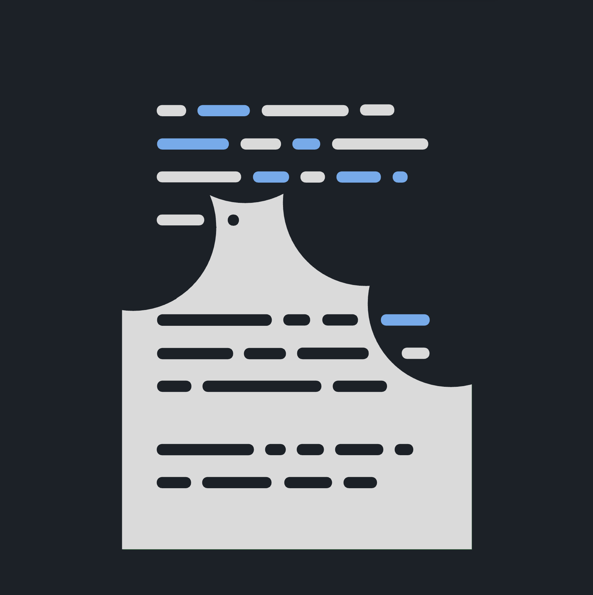

# Spanish Dictionary Builder (Obsidian Plugin)

<p align="center">
   
</p>

**Transform your Spanish learning with an intelligent, AI-powered dictionary builder for Obsidian.**

Open a Spanish text.\
Select an unknown word.\
Add it to your dictionary with context.\
Build connections between words.\
Create your personalized Spanish knowledge base.


## Overview

This Obsidian plugin helps you build a comprehensive Spanish dictionary with automatic word form detection, context examples, and intelligent linking between related words. It leverages AI to generate detailed dictionary entries and creates a connected knowledge base for effective Spanish learning.


## Key Features

### 🎯 **Core Dictionary Commands**

#### 1. **Generate Dictionary Entry**
Creates comprehensive dictionary entries including:
- **Pronunciation** with IPA notation
- **Word forms** (conjugations, plurals, gender variations)  
- **Morphological breakdown** 
- **Valence patterns** (for verbs)
- **Smart tagging** (ground form vs. derived form)
- **Automatic file organization** with sharded folder structure

#### 2. **Add Context to Dictionary**
Intelligently adds context examples with:
- **Smart anchoring** - creates block references (`^1`, `^2`, etc.)
- **Source linking** - `*[[filename#^1|^]]* context sentence`
- **Ground form handling** - adds context to both word and its base form
- **Capitalization normalization** - handles sentence-initial words properly
- **Cursor-aware sentence detection** - finds the exact sentence you're working with

### 🔧 **Text Processing Commands**

#### 3. **Normalize Selection (Add Links)**
Transforms Spanish text into a linked knowledge base:
- **Grammar-aware linking** - `corrían` → `[[correr|corrían]]`
- **Handles complex forms** - reflexive verbs, compound tenses, plurals
- **Smart exclusions** - leaves pronouns, auxiliary verbs unlinked
- **Preserves formatting** - maintains structure while adding connections

#### 4. **Translate Spanish to English**
Quick translation helper for comprehension and learning.

### 🎓 **Learning & Correction Commands**

#### 5. **Spanish Grammar Check & Homework Assistant**
Quick exercise checking and corrections:
- **Fast validation** - Simple ✅ or corrections with `==word==`
- **Exercise support** - fill-in-gaps, translations, grammar checks
- **Concise feedback** - immediate answers for homework

#### 6. **Spanish Writing Tutor & Detailed Analysis**
Comprehensive learning with detailed explanations:
- **In-depth corrections** with explanations under "Explicación"
- **Stylistic improvements** under "Mejora estilística" 
- **Educational feedback** - helps understand mistakes
- **Advanced grammar analysis**

## Smart Features

### **Intelligent Word Processing**
- **Ground form detection** - automatically identifies base forms (e.g., "pura" → "puro")
- **Capitalization handling** - `[[tengo|Tengo]]` for sentence-initial words
- **Context reuse** - reuses existing block references when adding multiple words from same paragraph
- **Auto-navigation** - automatically opens dictionary entry after adding context

### **Connected Knowledge Base**
- **Bidirectional linking** - connects word forms to base forms
- **Context anchoring** - enables easy navigation between source and definition
- **Graph visualization** - see connections between related words
- **Smart file organization** - optional sharded folder structure for large vocabularies

## Setup

### Prerequisites
1. **Dedicated Vault Recommended** - The plugin creates many interconnected files
2. **API Key Required** - Google Gemini API key for AI-powered features
3. **Folder Organization** - Set up a dedicated folder (e.g., "words") for dictionary entries

### Installation
1. Install the plugin in Obsidian
2. Configure your Google Gemini API key in settings
3. Set your dictionary folder path (default: "words")
4. Optionally enable sharded file structure for large vocabularies

### Essential Hotkeys
Set up keyboard shortcuts for frequently used commands:
- **Generate Dictionary Entry** - For creating new word definitions
- **Add Context to Dictionary** - For adding examples from reading material
- **Normalize Selection** - For processing Spanish text with automatic linking

## Usage Workflow

### Basic Dictionary Building
1. **Encounter unknown word** in Spanish text
2. **Select the word** and create a link `[[palabra]]`
3. **Navigate to the word file** and run "Generate Dictionary Entry"
4. **Return to source text**, select the word again
5. **Run "Add Context to Dictionary"** to add the sentence as an example

### Advanced Text Processing
1. **Select Spanish paragraphs** in reading material
2. **Run "Normalize Selection"** to automatically link all words
3. **Build interconnected knowledge base** through repeated use
4. **Use Graph View** to visualize word relationships

### Learning and Correction
- **Quick homework check** - Use "Spanish Grammar Check & Homework Assistant"
- **Detailed learning** - Use "Spanish Writing Tutor & Detailed Analysis"
- **Translation help** - Use "Translate Spanish to English" for comprehension

## Example Output

### Dictionary Entry
```markdown
🔵 [[gato]] /ˈɡato/ 

#forma-base #sustantivo

**Definición**: Animal doméstico felino...

### Formas Gramaticales
- **Singular**: [[gato]], [[gata]]
- **Plural**: [[gatos]], [[gatas]]

### Contexto
- *[[cuento-infantil#^1|^]]* El gato subió al tejado.
- *[[novela-española#^3|^]]* Los gatos duermen mucho.
```

### Context Addition
**Source file** (after adding context):
```markdown
*[[cuento-infantil#^1|^]]* El [[gato]] subió al tejado. ^1
```

## Network Usage

This plugin communicates with:
- **Google Gemini API** - For AI-powered dictionary generation, translation, and language analysis

Your API keys are stored securely in your Obsidian vault and are not shared with third parties.

## Configuration

### Settings
- **API Keys** - Google Gemini API key
- **Dictionary Folder** - Base folder for dictionary files (default: "words")
- **File Organization** - Enable/disable sharded folder structure
- **API Provider** - Currently supports Google Gemini

## License

This plugin is licensed under the MIT License. See the `LICENSE` file for details.

## Disclaimer

This plugin is not affiliated with or endorsed by Google. Use of the Google Gemini API is subject to their terms of service.
